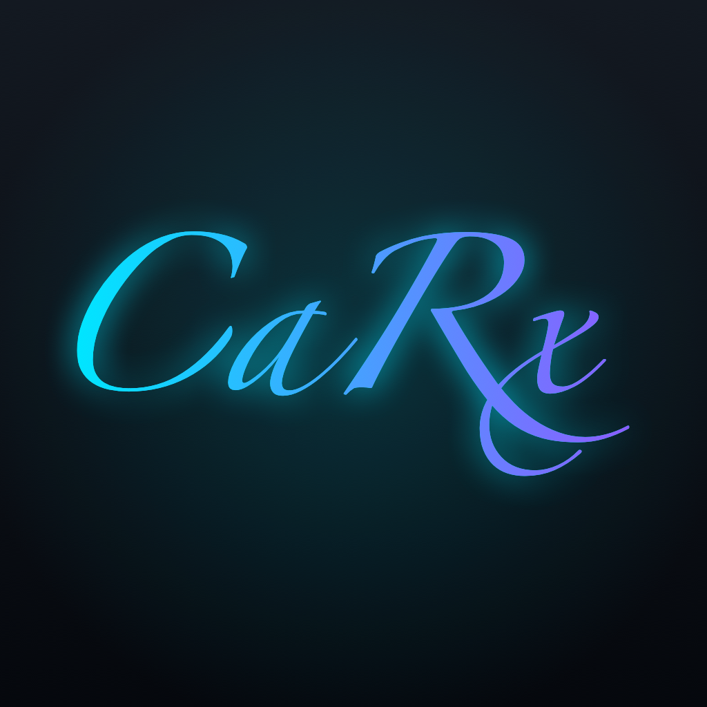

<p align="center">
  
</p>

<h1 align="center">CaRx</h1>

<p align="center">
  <b>A futuristic OBD-II diagnostic dashboard for iPhone and CarPlay.</b><br/>
  Live gauges, real-time charts, trouble codes, and model-specific sensors, straight from your car.
</p>

<p align="center">
  
  
  
  
</p>

<p align="center"><i>App from <a href="https://aaivu.co">aaivu.co</a> &mdash; TheSaravanas Group of Companies</i></p>

---

## What is CaRx?

CaRx connects to an **ELM327 OBD-II adapter** over **Bluetooth LE** or **Wi-Fi** and turns the data your car already produces into a dark, neon, instrument-cluster-style app. Build your own dashboard, watch sensors move in real time, read and clear check-engine codes, and keep a simplified view on your car's CarPlay screen.

The name is a nod to **Rx**: a prescription for your car.

## Features

| | |
|---|---|
| **Configurable dashboard** | Radial gauges, linear bars, digital cards, and sparkline cards. Add, remove, and switch between named layouts (e.g. *Daily Driver*, *Track*). Per-widget range overrides. |
| **Live charts** | Full-screen single-sensor chart with 30s / 1m / 5m windows and pause. |
| **Multi-series charts** | Pick any sensors. Channels that share a range overlay in one row; each distinct range gets its own row in real units. Tap the legend to show or hide a channel. Save charts as presets and export to CSV. |
| **Trouble codes** | Current, pending, and permanent codes with descriptions, freeze-frame info, a confirmed *Clear Codes* flow that re-reads to verify, and an event history. |
| **Vehicle profiles** | Built-in sensor packs for specific cars, plus a generic OBD-II profile for anything else. |
| **Bluetooth LE or Wi-Fi** | Choose the connection per vehicle profile. |
| **Demo mode** | Runs on simulated data by default, so you can explore the whole app with no adapter or car. |
| **CarPlay** | Glanceable live values, chart tiles, and trouble codes on the car screen (see [CarPlay](#carplay)). |
| **Raw PID discovery tool** | Send any mode/PID to any ECU header and inspect the raw reply, for verifying and building sensor packs. |

## Supported vehicles

| Vehicle | Extra sensors beyond standard OBD-II |
|---|---|
| **2014 Chevrolet Cruze** (1.4L Turbo) | Turbo boost, transmission fluid temp, high-resolution coolant temp |
| **2015 BMW** (N20/N55-era) | Engine oil temp, battery (IBS) voltage, turbo boost |
| **2020 Ram 1500** (HEMI / Pentastar / EcoDiesel) | Transmission temp, oil temp, turbo boost, DEF level (diesel) |
| **Generic OBD-II** | Standard SAE J1979 Mode 01 sensors only |

> **Heads up on enhanced sensors.** Manufacturer-specific PIDs are not published by the automakers; they are reverse-engineered by the community and vary by trim, engine, and ECU calibration. The Cruze values are carried over from a validated Android build. The **BMW and Ram PIDs are community-sourced placeholders** and are flagged *unverified* in the app until you confirm them against your car. Use the raw PID discovery tool to check and correct them.

## Hardware

You need an **ELM327-compatible OBD-II adapter**:

- **Bluetooth LE** adapters (e.g. OBDLink CX/MX+, Vgate iCar Pro BLE) that expose a UART-style GATT service.
- **Wi-Fi** adapters, which typically serve TCP at `192.168.0.10:35000` (host and port are configurable).

**Classic Bluetooth (SPP) ELM327 clones are not supported.** iOS has no public API for Bluetooth Classic serial without an MFi chip, so only BLE adapters work over Bluetooth.

## CarPlay

CarPlay does not allow custom drawing, so CaRx uses Apple's standard templates: a **Live** list of key sensor values, a **Charts** grid where each tile is a rendered trend image, and a **Codes** screen with a *Clear Codes* confirmation. The full gauge dashboard and interactive charts live on the iPhone.

CarPlay apps must carry an Apple-issued entitlement. CaRx targets the **Driving Task** category (`com.apple.developer.carplay-driving-task`). Until Apple approves it:

- The CarPlay scene is wired up but will not appear on a real head unit.
- **Simulator builds** already include the entitlement (`CaRx/Resources/CaRx-CarPlaySim.entitlements`), so you can test in Xcode via *I/O → External Displays → CarPlay*.
- Once approved, add the CarPlay capability in Xcode, regenerate your provisioning profile, and add the key to `CaRx/Resources/CaRx.entitlements`.

## Getting started

Requirements: Xcode 16+ (developed on Xcode 26), iOS 17+ deployment target.

```bash
git clone git@github.com:aaivu-ai/carx.git
cd carx
open CaRx.xcodeproj
```

1. Select the **CaRx** scheme and an iPhone simulator or device.
2. Set your own signing team under *Signing & Capabilities* if running on a device.
3. Run. **Demo mode** is on by default; turn it off in *Settings* to use a real adapter.

On first launch, pick your vehicle and connection type. CaRx creates a default dashboard for that vehicle.

## Architecture

```
CaRx/
├── App/            App entry, root/tab views
├── Transport/      OBDTransport protocol + BLE, Wi-Fi, and mock implementations
├── OBD/            ELM327 session, PID decoding, DTC parsing, vehicle packs (JSON)
├── Models/         SwiftData: profiles, layouts, widgets, chart presets, event log
├── Support/        OBDCoordinator, TelemetryStore, rolling buffers, theme
├── Features/       Dashboard, Gauges, DTC, Charts, Onboarding, Settings
└── CarPlay/        CarPlay scene, template controller, chart image renderer
```

Data flow: a **transport** delivers raw ELM327 lines to the **ELM327Session** (AT handshake, ECU header switching, request/response matching), which decodes PIDs into a shared **TelemetryStore**. The iPhone UI and the CarPlay templates both read that one store, so the two screens never disagree.

Built with **SwiftUI**, **SwiftData**, **Swift Charts**, **CoreBluetooth**, **Network.framework**, and the **CarPlay** framework, under Swift 6 strict concurrency.

## Adding a vehicle

Vehicle support is data, not code. To add a car:

1. Copy an existing pack in `CaRx/OBD/VehiclePacks/` (for example `cruze_2014.json`) and edit the sensors: request, ECU header, unit, range, and decoder.
2. Set `"verified": false` until you have confirmed the readings on a real vehicle.
3. Add the file name to `bundledFileNames` in `CaRx/OBD/VehiclePack.swift`.

Decoders come from a fixed set of formulas (`DecoderKind`), so packs cannot run arbitrary code.

## Tests

Unit tests cover PID decoder math, DTC parsing, and vehicle pack loading. Run them from Xcode with **Product → Test** (⌘U).

## Contributing

Issues and pull requests are welcome, especially **verified sensor packs for new vehicles**. Please work on a feature branch and open a PR against `main`.

## Disclaimer

CaRx reads data from your vehicle and can clear stored trouble codes. Clearing codes also resets readiness monitors, which can affect emissions inspections. Do not interact with the app while driving; use CarPlay for glances only. Enhanced sensor readings that are marked *unverified* may be wrong for your specific vehicle.

---

<p align="center">Made with care by <b>aaivu.co</b> &mdash; TheSaravanas Group of Companies</p>
